# Lameness Detection ML Pipeline System

A comprehensive Docker-based ML/AI pipeline system for cow lameness detection using YOLO, SAM3, DINOv3, CatBoost/XGBoost/LightGBM/Ensemble, and graph-based models.

## Architecture

The system is built as a microservices architecture with Docker containers, using NATS for asynchronous messaging between services.

### System Diagram

We keep the architecture diagram embedded directly in markdown (Mermaid + ASCII) to stay versioned with the codebase.

```mermaid
flowchart TB
  %% ======= Clients / UI =======
  subgraph UI[Admin UI]
    FE[admin-frontend<br/>React + TS]
    BE[admin-backend<br/>FastAPI]
  end

  %% ======= Infra =======
  subgraph Infra[Infrastructure]
    NATS[(NATS)]
    PG[(Postgres)]
    QD[(Qdrant)]
    FS[(Filesystem<br/>data/videos + data/processed + data/results)]
  end

  %% ======= Video lifecycle =======
  subgraph Video[Video lifecycle]
    ING[video-ingestion]
    PRE[video-preprocessing]
    CUR[clip-curation]
  end

  %% ======= Feature pipelines =======
  subgraph Feat[Feature extraction]
    YOLO[yolo-pipeline]
    SAM3[sam3-pipeline]
    DINO[dinov3-pipeline]
    TLEAP[tleap-pipeline]
  end

  %% ======= Identity =======
  subgraph ID[Identity / Tracking]
    TRACK[tracking-service<br/>ByteTrack + Re-ID]
  end

  %% ======= Predictors =======
  subgraph Pred[Predictors]
    ML[ml-pipeline]
    TCN[tcn-pipeline]
    TR[transformer-pipeline]
    GNN[gnn-pipeline]
    GT[graph-transformer-pipeline]
  end

  FUS[fusion-service]

  %% ======= UI wiring =======
  FE -->|HTTP| BE
  BE --> PG
  BE --> FS

  %% ======= Message bus =======
  ING -->|video.uploaded| NATS
  PRE -->|video.preprocessed| NATS
  CUR -->|video.curated| NATS

  %% ======= Feature extraction from preprocessed videos =======
  NATS --> YOLO
  NATS --> SAM3
  NATS --> DINO
  NATS --> TLEAP

  YOLO -->|pipeline.yolo| NATS
  SAM3 -->|pipeline.sam3| NATS
  DINO -->|pipeline.dinov3| NATS
  TLEAP -->|pipeline.tleap| NATS

  %% ======= Storage side effects =======
  PRE --> FS
  CUR --> FS
  YOLO --> FS
  SAM3 --> FS
  DINO --> FS
  DINO --> QD
  TLEAP --> FS

  %% ======= Tracking / cow registry =======
  NATS --> TRACK
  TRACK --> PG
  TRACK --> FS
  TRACK -->|tracking.complete| NATS

  %% ======= Predictors =======
  NATS --> ML
  NATS --> TCN
  NATS --> TR
  NATS --> GNN
  NATS --> GT

  ML -->|pipeline.ml| NATS
  TCN -->|pipeline.tcn| NATS
  TR -->|pipeline.transformer| NATS
  GNN -->|pipeline.gnn| NATS
  GT -->|pipeline.graph_transformer| NATS

  %% ======= Fusion =======
  NATS --> FUS
  FUS -->|pipeline.fusion| NATS
  FUS --> FS
  FUS -->|analysis.complete| NATS
```



Quick ASCII summary:

```
Upload → preprocess/curate → (YOLO, SAM3, DINOv3, T‑LEAP) → {ML, TCN, Transformer, GNN, Graph‑Transformer} → Fusion → Admin UI
                               │           │
                               │           └─ DINOv3 avg embedding → Qdrant (vector DB)
                               └─ YOLO + DINOv3 → tracking-service → Postgres cow registry (cow_identities + track_history)
```

> For detailed architecture documentation, see [docs/ARCHITECTURE.md](docs/ARCHITECTURE.md)
>
> For a step-by-step pipeline walkthrough (SAM3, DINOv3, T‑LEAP → ML + tracking/ID), see [docs/PIPELINES_DETAILED.md](docs/PIPELINES_DETAILED.md)

### Core Components

1. **Video Processing Layer**:
   - Video Ingestion Service - Upload, validate, and store videos
   - Video Preprocessing Service - Crop videos using YOLO detection
   - Clip Curation Service - Extract optimal 5s canonical clips

2. **Feature Extraction Pipelines**:
   - YOLO Detection Pipeline - Bounding boxes, confidence
   - SAM3 Segmentation Pipeline - Silhouette masks
   - DINOv3 Embedding Pipeline - 768-dim feature vectors
   - T-LEAP Pose Pipeline - Keypoints, locomotion metrics

3. **Deep Learning Pipelines**:
   - TCN Pipeline - Temporal Convolutional Network for gait analysis
   - Transformer Pipeline - Self-attention based temporal modeling
   - GraphGPS Pipeline - Graph Transformer for relational context

4. **ML Ensemble**: CatBoost, XGBoost, LightGBM with stacking

5. **Human-in-the-Loop**:
   - Pairwise Comparison (7-point scale)
   - Triplet Comparison (similarity/dissimilarity)
   - Rater Reliability (Dawid-Skene, tier system)

6. **Fusion & Explainability**:
   - Fusion Service - Combine all predictions with gating rules
   - SHAP Service - Feature importance explanations
   - LLM Service - Natural language summaries

7. **Admin Interface** (FastAPI + React): Dashboard, visualization, training module
   - Cow Registry: `/cows`
   - Cow Detail: `/cows/:cowId`

## Prerequisites

- Docker and Docker Compose
- Conda/Mamba (for local development)

## Quick Start

### Option 1: Fresh Deployment (Recommended)

Use the deployment script for a complete setup:

```bash
# Fresh deployment with all initializations
./scripts/deploy.sh

# Clean start (removes all data and volumes)
./scripts/deploy.sh --clean

# Skip rebuilding images
./scripts/deploy.sh --skip-build
```

This script:
- Creates required data directories
- Builds all Docker images
- Initializes PostgreSQL with all tables
- Creates Qdrant vector collections
- Sets up default admin user

### Option 2: Manual Docker Compose

```bash
# Start all services
docker compose up -d

# Initialize database (first time or after schema changes)
docker compose exec postgres psql -U lameness_user -d lameness_db < scripts/init_db.sql
```

### Access Points

| Service | URL |
|---------|-----|
| Frontend | http://localhost:3000 |
| Backend API | http://localhost:8000 |
| API Documentation | http://localhost:8000/docs |
| NATS Monitoring | http://localhost:8222 |
| Qdrant Dashboard | http://localhost:6333/dashboard |

### Default Credentials

- **Email:** admin@example.com
- **Password:** adminpass123

## Development Setup

### Using Conda

1. **Create base conda environment:**
   ```bash
   conda env create -f environment.yml
   conda activate lameness-detection-base
   ```

2. **Create service-specific environments:**
   ```bash
   cd services/video-ingestion
   conda env create -f environment.yml
   conda activate video-ingestion
   ```

### Running Services Locally

Each service can be run independently:

```bash
cd services/video-ingestion
conda activate video-ingestion
python -m uvicorn app.main:app --reload --port 8001
```

## Project Structure

```
vision-sam3-yolo-lameless/
├── services/                    # 22 Microservices
│   ├── video-ingestion/         # Upload handling
│   ├── video-preprocessing/     # YOLO-based cropping
│   ├── clip-curation/           # 5s canonical clip extraction
│   ├── yolo-pipeline/           # Object detection
│   ├── sam3-pipeline/           # Segmentation
│   ├── dinov3-pipeline/         # Embeddings
│   ├── tleap-pipeline/          # Pose estimation
│   ├── tcn-pipeline/            # Temporal CNN
│   ├── transformer-pipeline/    # Gait Transformer
│   ├── gnn-pipeline/            # GraphGPS
│   ├── ml-pipeline/             # XGBoost/CatBoost/LightGBM
│   ├── fusion-service/          # Prediction fusion
│   ├── rater-reliability/       # Dawid-Skene/GLAD
│   ├── shap-service/            # Explainability
│   ├── llm-service/             # Natural language explanations
│   ├── training-service/        # Model training orchestration
│   ├── annotation-renderer/     # Video annotation overlay
│   └── admin-interface/
│       ├── backend/             # FastAPI REST API
│       └── frontend/            # React + TypeScript + Tailwind
├── shared/                      # Shared code and config
│   ├── models/
│   ├── utils/
│   └── config/
├── data/                        # Data storage
│   ├── videos/
│   ├── canonical/               # Curated 5s clips
│   ├── processed/
│   ├── training/
│   ├── results/
│   └── quality_reports/
├── docs/                        # Documentation
│   ├── ARCHITECTURE.md
│   ├── PIPELINES_DETAILED.md
│   └── tracking-by-detection.md
├── research/                    # Research code and papers
├── docker-compose.yml
├── environment.yml
└── README.md
```

## API Endpoints

See the FastAPI documentation at http://localhost:8000/docs for complete API reference.

## Training Models

See [TRAINING.md](TRAINING.md) for detailed instructions on training YOLO, ML models, and ensemble methods.

## License

See LICENSE file for details.

